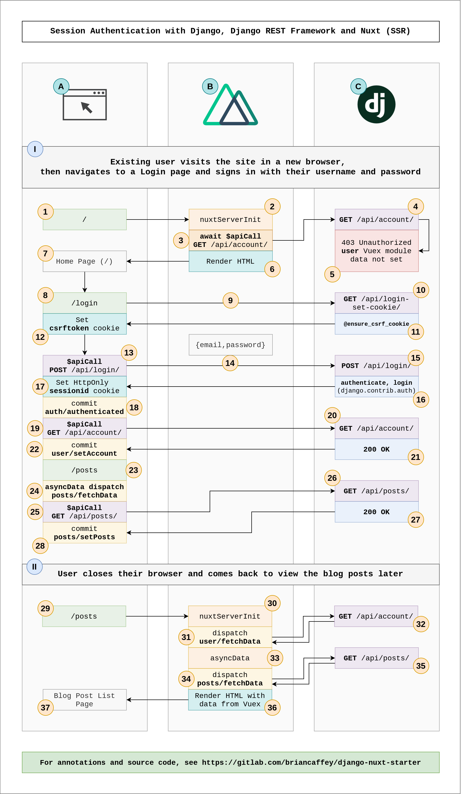

# Authentication data flow between the browser, Nuxt and Django

This diagram focuses on the interactions between:

I. The browser
II. The Nuxt server (Node process)
III. The Django backend API server (gunicorn process)

Here's link to an article about this on my blog, most of the contents of that article is in the comments of this post.

[https://briancaffey.github.io/2021/01/01/session-authentication-with-django-django-rest-framework-and-nuxt](https://briancaffey.github.io/2021/01/01/session-authentication-with-django-django-rest-framework-and-nuxt)

Here's a GitLab repo that where you can find the source code and other diagrams related to this project:

[https://gitlab.com/briancaffey/django-nuxt-starter](https://gitlab.com/briancaffey/django-nuxt-starter)

## Context

This will be a continuation of the discussion about how data flows in Django + Nuxt applications, looking specifically at session authentication.

For illustration purposes, I'm using a simple CRUD application that has two models: Users and (blog) Posts. Users can log in with email and password credentials and create, read, update and delete blog posts (CRUD). Currently I'm only doing the R (read) of CRUD: listing and viewing blog posts. Creating, updating and delete will be added later. For now, users must be logged in to see posts.

I'm still learning a lot about Nuxt and how it can be used with Django and Django REST Framework. This project is an effort at documenting my learning process, learning in public and learning from mistakes, so any feedback or guidance on what I have written here would be highly appreciated!

## Why Nuxt?

Using Nuxt (with Server Side Rendering, or SSR) is one of many ways to use Vue.js with Django. Vue is a progressive framework, which means that it can be gradually adopted into a project--you don't have to go all-in on the framework or rewrite the application from scratch to fit with how Vue works.

### Different ways to use Vue with Django

In terms of Django, here are some ways that you can use Vue:

- Vue as a jQuery replacement for adding basic interactivity in views served by Django templates
- Build a static Vue application and serve it as a set of static assets in a Django project alongside routes that are served by other normal Django templates views.
- Build a Vue SPA which consumes a Django API (usually built with Django REST Framework or similar), and serve it over a content delivery network (CDN).
- Use Vue to build an Electron desktop app that uses Django as an API

In these scenarios, Vue is served as either static assets (such as in the case of serving a SPA over a CDN), or Vue code is included in an HTML response from a server (where the view library, not your application, is served over a CDN), similar to how jQuery is used.

### Different ways to use Nuxt

Nuxt is a Framework that can be used in a few different ways, I'll briefly discus three ways in which Nuxt can be used. Common to all three of these ways of using Nuxt is the directory structure. No matter how you use Nuxt, it provides a great way to organize Vue code.

1. Static mode: this mode allows you to write Vue code which is built into a static HTML, and then that HTML is deployed to a CDN or webserver like NGINX. The developer (or CI/CD process) runs a command to generate HTML files for each page in the application, and these pages are served as-is when accessed by a user. I recently migrated my personal blog from Jekyll to Nuxt with full-static mode. Check it out at ([briancaffey.github.io](https://briancaffey.github.io)).

2. SPA mode: This is similar to what you might use if you started a Vue project with Vue CLI. The project is also generated as in Static Mode, but what is generated is primarily Javascript code that is executed on the browser.

3. SSR mode: Server Side Rendering is the mode that I'll be focusing on here. Unlike the other ways of using Vue that have already been discussed, this mode involves a Node.js server that will handle our requests. For example, a web request for `/posts` is sent to our Nuxt Server (a Node.js server process) and Node.js is responsible for returning HTML that contains all of the blog Posts that we want to show (or a paginated selection of all blog posts, which is how my example blog app is built). So the Nuxt app has to make a request to our Django API server before returning fully rendered HTML page for the `/posts` page. The user then gets the page from Nuxt, reads all of the blog posts and then decides to check out the blog posts on the second page of posts. When the user clicks on page 2, we request the second page of data from our Django API directly, not from Nuxt. The user then sees a short loading animation followed by the second page of blog posts that are loaded in using AJAX (usually with `fetch` or axios).

### Nuxt Benefits

The main reason for using Nuxt is to render the first page loads on the server, returning a complete HTML response that can be beneficial for SEO, social sharing, and other scenarios where you need control over how a website's pages are delivered (specifically, the initial request made to the server).

This type of control is not possible for applications that serve Vue over CDN since they can only request backend API data once the JS client has been requested from a CDN.

### Nuxt Downsides and Tradeoffs

Using Nuxt for SSR introduces quite a bit of complexity in both the application deployment and our Vue code. The backend API won't have to change at all when moving to Nuxt from a static Vue SPA.

Django alone is capable of returning fully generated, SEO-optimized HTML for each request, but applications built with Vue and Django templates may be difficult to work on as the project grows larger and larger. The Django/DRF + Nuxt approach may be more appropriate for projects with dedicated backend and frontend teams.

One other potential downside is added latency because of the "double request". If the Nuxt server and the Django server are on the same machine, then this latency will probably be a non-issue.

## Diagram

This diagram looks at session authentication with a focus on the browser, the Nuxt server and the Django server. It looks at two simple user stories, ordered from top to bottom in the diagram.

I. An existing application user visits the site in a new browser, navigates to the Login page, logs in with credentials and then visits a protected page: `/posts`.
II. The user closes the browser and then comes back directly to the `/posts` page.

These two user stories sound simple, but they touch on a lot of the features of Nuxt that make it powerful, and complicated at first (for Vue users). These include:

- `asyncData`
- `nuxtServerInit`
- Vuex on the client and server
- Custom plugin for axios
- Nuxt middleware on the client and server

Some important parts of Nuxt that this diagram does not (yet) touch on are:

- Nuxt auth module (I don't know if this is relevant for my use case)
- Nuxt fetch property (different from the `fetch` web API)

### User story I.: A user tries to open `/posts`, is redirected to `/login`, logs in, then navigate to `/posts` and sees blog posts

1. User navigates to `http://domain.com/`. This request is handled by the Nuxt server.

2. The `nuxtServerInit` action is called ([read more on nuxtServerInit](https://nuxtjs.org/docs/2.x/directory-structure/store#the-nuxtserverinit-action)). This is a special Vuex action that, if defined in `store/index.js`, will be called once per request to the Nuxt Server (when a page is initially visited or refreshed in the browser).

3. `nuxtServerInit` dispatches a Vuex action in the `user` module called `fetchData`. This action makes an GET request to `/api/account/` in the Django application.

4. An API call to `/api/account/` is made to the Django backend directly from the Nuxt container over the docker network (`backend:8000`)

5. If the request is made by an anonymous user (no user is logged in), a 403 response is returned to the Nuxt server and no account data is set in the Vuex store (on the server).

6. Since the user is currently not logged in, the request returns a 403 response.

7. `authMiddleware` (on the Nuxt server) redirects the user to `/login` based on the value of `authenticated` in the Vuex store. The Original request for `/posts` returns a fully-rendered `/login/` page instead.

8. User is now on the Login page

9. The `created` hook for the Login page makes a GET request to `/api/login-set-cookie/`.

10, 11. This endpoint calls a simple view that is decorated with `@ensure_csrf_token`.

12. When the response returns to the browser, the `csrftoken` is set in the browser.

13. The $apiCall function is defined in `plugins/axios.js`, and it adds the `csrftoken` cookie to the `X-CSRFToken` header of API requests. This is important for POST request where the CSRF token is required. When the user fills out their email and password in the login form, the $apiCall function is called with `/api/login/` and the email/password as credentials.

14. The email and password are sent as data in the POST request to `/api/login/`.

15, 16. The `/api/login/` URL calls the `login_view` which makes use of two functions from `django.contrib.auth`: `authenticate` and `login`. `authenticate` gets a user from the provided email/password, and the `login` function sets an HttpOnly `sessionid` session cookie on the response.

17. The HttpOnly `sessionid` cookie is automatically set on the browser when the `/api/login/` request returns successfully.

18. When this `/api/login/` request returns successfully, a value in the `auth` Vuex module is set to keep track of the current user's logged in state.

19. Next, a GET request is made to `/api/account/`.

20, 21. Since the `sessionid` cookie is set and sent along with the request automatically, this request will succeed.

22. When the `/api/account/` request returns, the user's account information is saved to the `user` Vuex module. At this point, the client may redirect automatically to the home page, or user account page, dashboard, etc.

23. Now logged in, the user navigates (again via Vue router) to `/posts`, a page that shows a paginated view of all blog posts.

24. This page has an `asyncData` method which is called when the page component is created and it dispatches a Vuex action `posts/fetchData`.

25. This Vuex action makes a GET request to `/api/posts/`.

26, 27. `/api/posts/` uses a `ModelViewSet` and returns a paginated list of blog posts

28. When the `/api/posts/` request returns successfully, the blog post data is saved to the `blog` Vuex module.

### User story II.: Logged in user opens new browser window and revisits `/posts`

29. The user closes their browser and then opens a new browser window and navigates to `/posts`.

30. `nuxtServerInit` is called as usual,

31. The `user/fetchData` action is called. This action makes a GET request to `/api/account/`.

32. The `/api/account/` request returns successfully. The `sessionid` cookie is passed along from the browser to the API request that is made from the Nuxt server to the backend API (`/api/account/`).  User account data is then set on the Vuex `user` module.

33. The `asyncData` method for the `/posts` pages is called.

34. `asyncData` dispatches a Vuex action `posts/fetchData`

34. `posts/fetchData` makes an API request to `/api/posts/`.

35. The `/api/posts/` request is handled by a `ModelViewSet` for the `Post` model that gets blog posts and then sets them to the Vuex store (on the server) when the request returns a response (to the Nuxt server).

36. Once the async data fetching is compete (`nuxtServerInit` and `asyncData` for the `/posts` page), the page HTML is rendered using the Vuex store data stored on the server. The Vuex data is sent back with the rendered HTML (I think this is how it works).

37. Finally, the user sees the list of blog posts. The page is loaded "at once"; there is no waiting for data to load after loading the page initially.

## Discussion

### Complexity

Is this authentication process overly complicated? When I make these diagrams, I try to make simple concept as detailed as possible, but there are a lot of distinct actions being taken in many different parts of the application and getting them all into one diagram was tricky.

### HttpOnly Session Cookies

Session authentication is the officially recommended way to do authentication with Django REST Framework for clients that run in the browser. However, there seem to be lots of people using JWT with DRF and Javascript clients that run in the browser. The main argument against doing this is that the JWT must be stored in a Javascript-accessible store (localStorage or Cookies) so it can be passed with each request. Many people are also interested in trying to store JWT for authentication in HttpOnly cookies to harden client-side security. I'm very curious to know if anyone is actually doing this, and what the implementation looks like. While `djangorestframework_simplejwt` doesn't support HttpOnly, there seems to be lots of interest in doing this.

Some use cases for JWT and other token authentication methods with DRF might include native mobile apps or Desktop apps. For most cases, I think session authentication with Django's built in session cookies for DRF authentication is the best option. JWTs also have no clear solution for logging out, which may be important for some security considerations. The concept of stateless authentication is interesting, but for most use cases I would argue that it is not worth doing. Let me know if anyone has thoughts on this, I'm curious to see what everyone thinks.

### Next Steps

I successfully deployed this application to a docker swarm cluster on a Raspberry Pi and it seems to be working well.

My next steps for this project/repo are to deploy this to a production environment as soon as I have time to do so. My local setup has been working well, and I think it should work well for a simple DigitalOcean docker swarm deployment like I have done with other Django + Vue projects.

I also want to add the update and delete functionality for posts, improve error handling with API calls, add form validation, and maybe write some tests with Jest.

## Questions

Here are some questions and areas that I still need to investigate.

### Nuxt Composition API

I have seen that there is a Composition API module for Nuxt. I have only just now started looking at Composition API examples and documentation for "vanilla" Vue, but I have heard that the Nuxt Composition API module has some additional features specifically for use with Nuxt, so I'm curious to learn what these are.

### Nuxt v3 and Vue 3

Nuxt looks like it has plans to support Vue 3, so I am interested to learn more about Vue 3 as it is adopted by Vue frameworks such as Nuxt and Quasar.

### Nuxt's fetch method, server middleware, Nuxt auth module

I think I am using server middleware correctly, it can be improved by redirecting to the initial requested route after successful login. I'm not sure if I should use the Nuxt auth module in this application, I have read that it doesn't support HttpOnly cookie use cases, but I could be wrong.