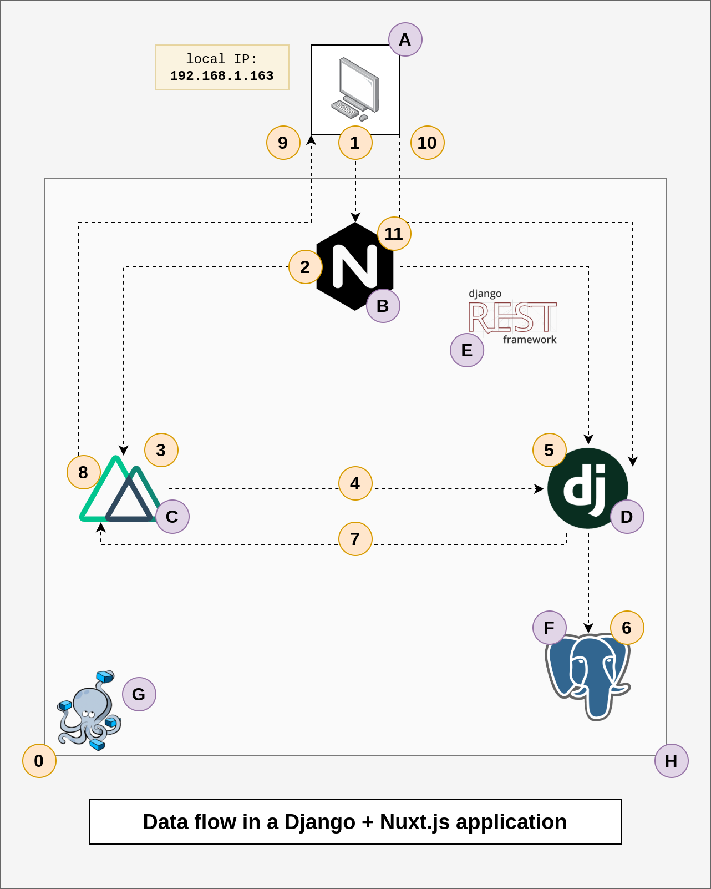

# Data Flow in a Django + Nuxt.js application

Over the holidays between lots of big meals and many naps, I tried to tackle one more goal of mine before this year come to an end: building an application with Django and Nuxt.js.

This year I rebuilt my personal blog ([briancaffey.github.io](https://briancaffey.github.io/)) with Nuxt.js, the `@nuxt/content` headless git-based CMS and TailwindCSS. It is statically generated with Nuxt's full-static mode and has been really enjoyable to work with. I have also learned a lot more about SEO and how Nuxt helps improve Vue applications' SEO. I have also been working a lot with Django and Vue.js applications where Django serves as an API to a Vue.js SPA. This combination of technologies works well for a lot of use cases, but it falls short in SEO. Nuxt also provides a great way to organize large Vue.js projects which I have been finding very helpful. For these reasons, combining Django and Nuxt has been something that I have wanted to try for a while, so this article will share some of my experiences in recent efforts to build with these two frameworks. I took [detailed notes of each step of the project setup](https://gitlab.com/briancaffey/django-nuxt-starter/-/blob/develop/STEP_BY_STEP.md) starting from an empty repository, and I put together a diagram of my understanding of how data flows in the application.

Here's the link to the project repository that I'll be referencing: [https://gitlab.com/briancaffey/django-nuxt-starter](https://gitlab.com/briancaffey/django-nuxt-starter)

This article will focus on explaining the project through the diagram shown below. I added two types of labels: letters and numbers. The letters will introduce each component of the application and its role in the application as a whole. The numbers summarize how data flows through the different components in my sample blog application.

## Diagram components

A. Your computer - Possibly also your development machine which is running the application in docker containers with docker-compose.

B. NGINX - This is the "front desk" of the application that does a few different things. It is the first component that web requests come to. It serves as a reverse proxy which does path-based routing. It looks at the URL request and determines where to send it. For example: `/api/posts/1`, `/dashboard/`, `/admin/` could all be routed differently depending on the NGINX configuration file. We will look at this again in the next section. This  component, like most of the other things in the diagram, runs in a container. NGINX can also serve static files for our Django app and do TLS termination to make our application available over a secure HTTPS connection.

C. Nuxt.JS server - The first "S" in SSR (server side rendering). It is a Node.js process that renders HTML from Vue components that we define in our Nuxt app, as well as data fetched from other servers/APIs before returning HTML back to the client.

D. Django server - This runs the WSGI application with a gunicorn process in a container.

E. Django REST Framework is a Django package the facilitates the creation of REST API endpoints. This is part of the Django application, it primarily takes care of data serialization (which can be thought of as translating between JSON and Python objects that represent rows of data in our Postgres database)

F. This is the Postgres database, also a containerized service. It is on the same docker network as the Django/gunicorn application, so the Django application can connect to the Postgres database using the hostname `postgres`.

G. docker-compose is used to orchestrate the docker network, containers and volumes that make up the application.

H. This box represents the docker network that allows for easy networking between services. We will come back to this the significance of this in the next section.

## Data flow in the application

The simple application I have built for this demonstration is a blog. There is only a list view and a detail view for simple blog post model with three fields: title, body and created date. For the list view, the frontend (Nuxt) route is `/posts/` and the backend route is `/api/posts/` for the detail view the frontend route is `/posts/_id` and the API route is `/api/posts/_id/`.

The data flow shown here will walk through what happens when a user visits `http://localhost/posts/`, and then show what happens when the user clicks on one of the listed posts to see the detail view of the post (`http://localhost/posts/2`).

0. `docker-compose up` is one command that is used to start the entire application in local development. This exposes the NGINX process on port 80 of the host machine (your laptop).

1. When the application is running on your machine and you navigate to `http://localhost/posts/`, the request is first handled by NGINX.

2. As we mentioned earlier, NGINX's path-based routing sends all requests that do not start with `/api/*` or `/admin/*` to the Nuxt.js server.

3. When the request gets to the Nuxt server, the Nuxt lifecycle methods start. The important one that I'm using so far is `asyncData`. This property is used to request data that will be used in the rendering of our HTML response.

4. Inside of `asyncData`, the application uses axios to make a request to `/api/posts/` (for example). In `nuxt.config.js`, the `privateRuntimeConfig` sets a baseUrl value for axios to `http://backend:8000`. Since the Nuxt server is on the same docker network as the backend Django/gunicorn server, the Nuxt server is able to resolve `http://backend` to the address of the backend server.

5. Django processes this endpoint, using the `PostViewSet`, the views of which have been added to `urlpatterns` in `blog/urls.py`.

6. The `PostViewSet` makes a database query on the `posts` which is used to serialize the data.

7. The Django server returns the response to the original axios call.

8. The data returned from Django is used to render the HTML response.

9. The HTML response from the Nuxt server is sent back to the browser that originally navigated to `http://localhost/posts/`.

10. The user is presented with page that lists blog posts. Each blog posts lists to a detail view. When a blog post (let's say the post with `id` of 2) is clicked on, a request for `/posts/2/` is made directly to the Django backend. The `browserBaseURL` value in the `axios` settings under `publicRuntimeConfig` defined in `nuxt.config.js` is set to `http://localhost`, so the request is made to `http://localhost/api/posts/2/`. To clarify, since we are making this request using axios in the browser, we can't make a request to `http://backend:8000/api/posts/2/` like we did in step 4 (`http://backend:8000/api/posts/`) because the browser doesn't know how to resolve the `backend` hostname.

11. This request to `http://localhost/api/posts/2/`, like all others, first goes to NGINX which sends it to the backend since the path starts with `/api/`. At this point the application functions like a regular Vue SPA making axios calls to a backend service. This is because we used `<nuxt-link>` for the posts listed in the posts list view. If we used `<a>` tags, we would go through the same process as in step 4 where the HTML is rendered on the Nuxt server and sent back to the browser all at once.

## Discussion

My main takeaway is that using Nuxt and Django together can give you good SEO and a great SPA experience at the same time. Using Django alone, or Django with traditional non SSR Vue makes this harder to do. Being a progressive framework, there are a lot of ways to use Vue with any other backend. From what I have heard, most people use Vue via CDN similar to how jQuery was and still is delivered for use in the browser.

There is additional work in setting up 3 servers for a single application (Nuxt, Django and NGINX), but the tradeoff is that I am (at least I feel) very productive writing frontend logic in Vue and backend logic with DRF. I have never liked working with Django templates and I used to know a lot more about them than I do now.

## Spotlight for baserow.io's awesome open-source Django Nuxt application

Lastly I want to mention that there are some great resources in the [nuxt-community/awesome-nuxt](https://github.com/nuxt-community/awesome-nuxt) GitHub repo. There's one project that really stood out to me when I searched for "django" projects in the README, and that project is called [baserow.io](https://baserow.io/) (repo: [https://gitlab.com/bramw/baserow](https://gitlab.com/bramw/baserow)). Please check this repo our if you are interested in Django and Nuxt. This company is building an open source no-code database, similar to Airtable which I have worked with before.

Their entire product is open source and I have been very impressed with what I have seen. Please go give that project a star or consider becoming a Github sponsor if you are interested. I'm not affiliated with that project in any way, but I'll be referencing how they use Django and Nuxt to build their application.

## Next steps

There is a still a lot I have to learn about Nuxt. I'm still very new to the Framework and this is my first time using Nuxt's SSR mode. Nuxt seems to have its own way of doing lots of things that I'm used to doing in Vue. There is a very supportive community and well-maintained official packages to help with lots of things, like the `@nuxt/axios` package that I'm using.

My next step is to keep expanding my blog application. One thing I didn't mention is authentication. I plan on using Django session authentication for authenticating request to Django. It seems that it already works correctly in my application (logging in through Django admin and then navigating to Nuxt routes that make Django requests are working only when I'm logged in.) I think I have an idea about how Vuex, authentication and route guards will work together, but I haven't gotten there yet. If anyone has some good reference projects or recommendations on how to expand on what I already have, please let me know!

I know that Nuxt has an auth module, so I need to see if that is relevant for what I want need in my application. I also need to continue reading the Nuxt documentation. I still don't know what I don't know about Nuxt and the plugins and modules that it makes available. I also noticed that Nuxt has it's own version of the Vue 3 Composition API, something I am just now starting to learn more about, so that it another area I'll need to dig into eventually.
